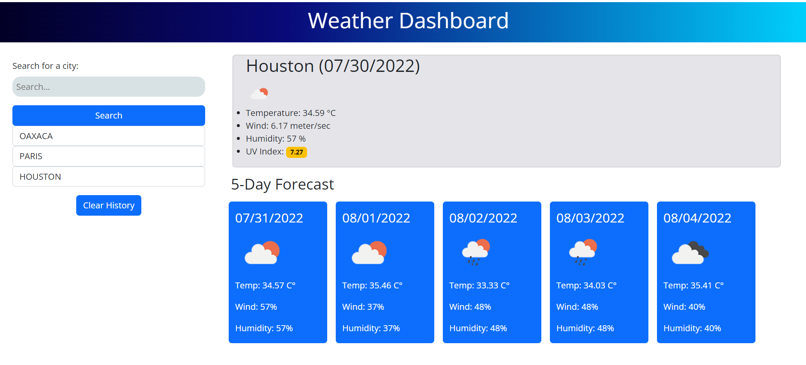

# Weather Dashboard
 
A weather dashboard that allows users to search for a city and obtain specific information about the current weather (main temperature, humidity levels, wind speed, and UV Index) as well as a general forecast for the next five days. Cities that users previously looked up will be saved in their local storage. This application runs in the browser and features dynamically updated HTML and CSS; it uses Bootstrap as style framework and OpenWeather API for fetching information.

## Links 

Deployed URL: https://jcuetos97.github.io/Weather-Dashboard/

GitHub Repository URL: https://github.com/jcuetos97/Weather-Dashboard

    

